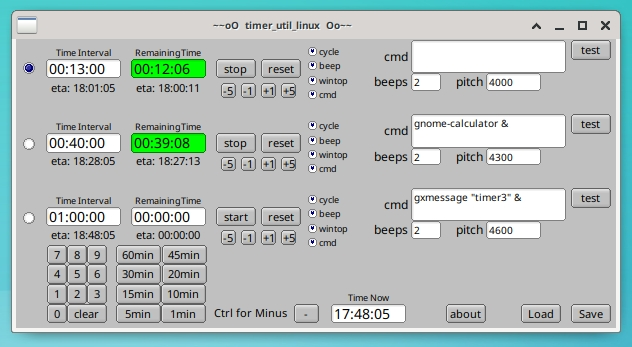

Apr 2024 v1.06

### timer_util_linux
Linux triple countdown timer utility (gui), features: auto cycle, window to top, adj beep pitch freq (if o/s supports beep cmd), and ability to execute bash commands.

### Purpose
To count time.

### Dependency
Requires: FLTK library, a lean but function gui library for linking, fltk-1.3.4-2 or better should work.

### Build
The code was developed with gcc on Ubuntu 20.04 64 bit.

Build this app by typing 'make', no installation is required.

### Usage
Run app from where you built it, it also needs write permissions to same folder to save 'timer_util_linux.ini' on exit.

Hover over some control to see hints. Enter times using keypad buttons, not keyboard. The minute increment buttons can be right clicked to decrement Time Interval.

_**Add** an ampersand at end of a bash command to make cmd run in the background, else you won't be able to make this utility come back to the foreground till bash command completes._

### Code and Shortcomings
Some of the code is re-purposed from other projects I've tinkered with over the years, so excuse the prehistoric c style, evolving conventions and inefficiencies.

Fltk's fluid gui designer was used for layout of main window controls, fluid generated 'fluid.h' and 'fluid.cxx'.

